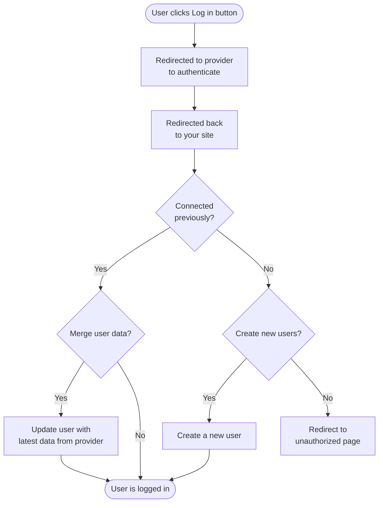

## Overview

Statamic supports OAuth authentication via [Laravel Socialite](https://github.com/laravel/socialite), which includes support for Facebook, Twitter, Google, LinkedIn, GitHub, and Bitbucket.

The [Socialite Providers][socialite-providers] Github organization contains over 100 additional pre-built providers that you can take advantage of as well.

If you require a provider not on the list (perhaps you need a custom one for your own application), you may [create your own provider](#custom-providers).

## Installing Socialite

Install Socialite with the following Composer command:

``` shell
composer require laravel/socialite
```

Enable OAuth in `config/statamic/oauth.php` or in your environment file:

``` env
STATAMIC_OAUTH_ENABLED=true
```

Add the provider to the [oauth config](#configuration). This will allow Statamic to add buttons to the CP login form.

``` php
'providers' => [
    'github',
    'apple',
    // etc
],
```

Add your provider's credentials to `config/services.php` and [callback URL](#routes) as per the Socialite documentation:

``` php
'github' => [
    'client_id' => env('GITHUB_CLIENT_ID'),
    'client_secret' => env('GITHUB_CLIENT_SECRET'),
    'redirect' => 'http://your-site.com/oauth/github/callback',
],
```

If you plan to use a third party provider, follow the steps [below](#third-party-providers).

## Usage

OAuth can be used to log in and to create new accounts.

### Authenticating

Send your users to the provider’s login URL to begin the OAuth workflow. Buttons for each configured provider will be available on the Control Panel's login page, but you may also do this on the front-end with the [`oauth` tag][tag]:

```
<a href="{{ oauth:github }}">Log in with Github</a>

{{# or with a loop... #}}

{{ oauth }}
  <a href="{{ url }}">Log in with {{ label }}</a>
{{ /oauth }}
```

Check out the [tag usage][tag] for more information.

### Creating accounts

If logged out and no existing user matches the provider account, Statamic will automatically create a new user the first time someone logs in with a provider. This behavior can be disabled via the `create_user` [config option](#user-flow).

By default, only a subset of data will be copied to the new user account. You can customize this in [customizing user data](#customizing-user-data).

### Connecting accounts

A user can connect their account to any configured providers within their account area of the Control Panel.

On the front-end, you can build your own OAuth connect/disconnect UI using the [`oauth` tags][tag].

## Configuration

OAuth behavior may be configured in `config/statamic/oauth.php`.

### Providers

You should add your intended OAuth providers to the config so Statamic can provide your users with buttons on the login page.

You can specify just the name of the provider, or use a name/label pair if you would like to customize how it's displayed.

``` php
'providers' => [
    'facebook',
    'github' => 'GitHub',
    'twitter',
],
```

If a provider requires ["stateless authentication"](https://laravel.com/docs/socialite#stateless-authentication), you may pass an array and specify the `stateless` config option:

``` php
'providers' => [
    'saml2' => ['stateless' => true, 'label' => 'Okta'],
],
```

However, existing accounts cannot be connected to a stateless OAuth provider. They can only be used to create fresh accounts.

### Routes

There are 3 routes involved in the OAuth workflow:
  - A login redirect route, which sends users to the provider's login page.
  - A callback route, which the provider will redirect to after a successful login.
  - A disconnect route, which disconnects a provider from the current user's account.

You may customize these in `config/statamic/oauth.php`:

``` php
'routes' => [
    'login' => 'oauth/{provider}',
    'callback' => 'oauth/{provider}/callback',
    'disconnect' => 'oauth/{provider}/disconnect',
],
```

When you create your OAuth application, you will need to provide the callback URL.

### User flow

Here's the complete flow, including the config options below that affect it:



You may choose to customize this flow:

| Option | Description |
|--------|-------------|
| `create_user` | Whether a new Statamic user account should be created when no matching user is found. If `false`, the user will be redirected to the unauthorized page instead. |
| `merge_user_data` | Whether an existing user's data should be updated with the latest data from the provider each time they log in. |
| `unauthorized_redirect` | The URL to redirect to when a user is denied access (for example, when `create_user` is `false` and no matching user exists). If left `null`, it will redirect to the Control Panel's unauthorized page when applicable, or to the home page. |

## Third party providers

If you would like to use a provider not natively supported by Socialite, you should use the [SocialiteProviders][socialite-providers] method.

1. Require the appropriate provider using Composer:
    ```
    composer require socialiteproviders/dropbox
    ```

1. Next, add an event listener in your `AppServiceProvider`'s `boot` method:
    ```php
    // app/Providers/AppServiceProvider.php

    Event::listen(function (\SocialiteProviders\Manager\SocialiteWasCalled $event) {
        $event->extendSocialite('dropbox', \SocialiteProviders\Dropbox\Provider::class);
    });
    ```

    Alternatively, if your application has an `EventServiceProvider.php` file, you can register the event listener in there:

    ```php
    protected $listen = [
        \SocialiteProviders\Manager\SocialiteWasCalled::class => [
            'SocialiteProviders\\Dropbox\\DropboxExtendSocialite@handle',
        ],
    ];
    ```

3. Add the service credentials to `config/services.php` config:
    ``` php
    'dropbox' => [
        'client_id' => env('DROPBOX_CLIENT_ID'),
        'client_secret' => env('DROPBOX_CLIENT_SECRET'),
        'redirect' => 'http://your-site.com/oauth/dropbox/callback',
    ],
    ```

4. Add the provider to the `config/statamic/oauth.php` config:
    ``` php
    'providers' => [
        'dropbox',
    ],
    ```

## Custom providers

If your OAuth provider isn’t already available in Socialite or [SocialiteProviders][socialite-providers], you may create your own.

To create your own OAuth provider, you should make your own SocialiteProvider-ready provider. All that's needed is the event handler (eg. `DropboxExtendSocialite.php`) and the provider (eg. `Dropbox.php`).

Follow the [third party installation steps](#third-party-providers), but skip the Composer bits. You can just keep the classes somewhere in your project.

## Customizing user data

After authenticating with the provider, Statamic will try to retrieve the corresponding user, or create one if it doesn't exist. You may customize how it's handled by adding a callback to your `AppServiceProvider`.

### User data

The only data added to the user will be their `name`. If you would like to customize what gets added to the user, you can return an array from the provider's `withUserData` callback.

The closure will be given:
- an instance of `Laravel\Socialite\Contracts\User`
- the existing `Statamic\Contracts\Auth\User` if one already exists.

``` php
use Statamic\Facades\OAuth;

OAuth::provider('github')
     ->withUserData(fn ($socialiteUser, $statamicUser) => [
        'name' => $socialiteUser->getName(),
        'created_at' => optional($statamicUser)->created_at
                        ?? now()->format('Y-m-d'),
    ]);
```

:::warning
This user data will get merged into the user every time they log in using OAuth. This includes if they had an existing non-OAuth user account.
:::

### Customize entire user creation

If you want more control over the actual user object being created, you can return a user from the provider's `withUser` callback. The closure will be given an instance of `Laravel\Socialite\Contracts\User`.

``` php
use Statamic\Facades\User;
use Statamic\Facades\OAuth;

OAuth::provider('github')->withUser(function ($user) {
    return User::make()
        ->email($user->getEmail())
        ->set('name', $user->getName());
});
```

:::warning
This will only be used when the user is initially created. If you'd like to also update the data on every login, you should combine this with the `withUserData` option above.

```php
public function boot()
{
    OAuth::provider('github')
        ->withUserData(fn ($user) => $this->userData($user))
        ->withUser(function ($user) {
            return User::make()
                ->email($user->getEmail())
                ->data($this->userData($user));
        });
}

private function userData($user)
{
    return [
        'name' => $user->getName(),
    ];
}
```
:::

[socialite-providers]: https://socialiteproviders.com/
[tag]: /tags/oauth
